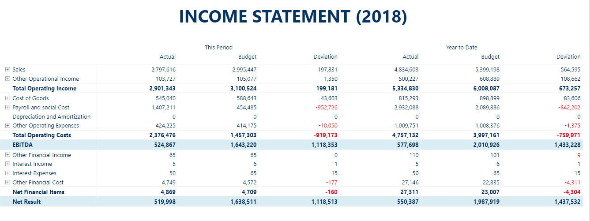

# Financial Reporting Matrix by Profitbase []

#### An improved matrix visual with advanced formatting

The Financial Reporting Matrix custom visual provides calculations and conditional formatting for matrix style reports. It provides a number of features not available in the standard matrix visual, including line formatting, conditional formatting, subtotals, and more. Custom calculated lines and custom format specifications can be defined directly in the data model. Configured via the standard fields and formatting pane. Particularly suited for financial reports.



## Have questions or need help?

To get started and explore features, please visit our [Wiki](https://github.com/Profitbase/PowerBI-visuals-FinancialReportingMatrix/wiki).  
If if you have found a bug, have a feature request or any other type of inquery regading this visual, please submit an [issue](https://github.com/Profitbase/PowerBI-visuals-FinancialReportingMatrix/issues), and we'll answer you as quickly as we can.


## Features

- Subtotals
- Line formatting
- Cross-highlighting / Cross-filtering
- Multiple column headers / Pivoting
- Sticky column and row headers
- Conditional formatting
- Configure via fields and formatting pane
- Supports formatting and calculations from the data model

For any questions about this visual, please submit an [issue](https://github.com/Profitbase/PowerBI-visuals-FinancialReportingMatrix/issues).

## Getting started

### Get it from Marketplace

[Download the visual from Microsoft AppSource](https://appsource.microsoft.com/en-us/product/power-bi-visuals/WA200000642?tab=Overview)  
[Download from Profitbase](https://www.profitbase.com/powerbi/) (Latest official version)  

### Video tutorial

[Demo - Create a basic income statement](https://www.youtube.com/watch?v=O0ibpu_np80)  
[Demo - New features in version 3](https://www.youtube.com/watch?v=jHt3l1K6At8&t)  

### Step-by-step guide

1. Install the Financial Reporting Matrix by Profitbase from AppSource.
2. Add your data source
3. Add the visual to the dashboard
4. Configure the bucket fields
   - Rows - Drag-drop the column(s) that represents the report line.
   - Columns - Drag-drop the columns(s) to pivot on.
   - Values - Drag-drop at least one measure.

#### Add subtotals

1. Click the edit link in the upper right menu of the visual.
2. Right click a row and select 'Add row'. This will add a (subtotal) row below the right-clicked row.
3. Provide a name.
4. Click the rows you want to include in the formula. By default, addition operators applied, but you can change this manually.

#### Add conditional formatting

1. Right click a column header and select 'Add conditional formatting'.
2. Using the editor that appears over the matrix, specify the rule and style to apply.
3. By default, the style 'custom 1' is selected. You can select a different style from the rule editor drop down.
4. From the 'Format' tool, modify the 'custom 1' style to meet your requirements.

## Calculations and formatting from the data model

This is an (optional) advanced feature that lets you embed formulas, formatting rules and styling in the data model instead of setting it up in the visual.

```json
{
  "id": "L1Sum",
  "displayName": "1Sum - Reportline",
  "formula": "L10+L12+L13+L14+L15+L17+L19",
  "style": "bold overline",
  "formatString": "#,0",
  "signFactor": 1
}
```

- **id**: A short identifier for the report line.
- **displayName**: The description shown in the matrix.
- **formula**: The calculation to run on the report line. Use **id** references to other report lines. Simple mathematical formulas supported.
- **style**: A string of one or more styles to apply, seperated by a whitespace
- **formatString**: the format string for formatting values. We use [numbro.js](https://numbrojs.com/) to format numeric values.
- **signFactor**: the values on the reportline.

## Early adopters / getting the latest bits

Because updating a Power BI custom visual published to AppSource takes many weeks to complete, getting fixes and new features out to customers makes it hard to move fast. For those of you that can (and want) to get the latest updates before they are available on AppSource, we offer you the option to download the visual as a file directly from us, so that you don't have to wait for the submission / validation process to complete.

[Get the latest bits here](https://github.com/Profitbase/PowerBI-visuals-FinancialReportingMatrix/releases)
