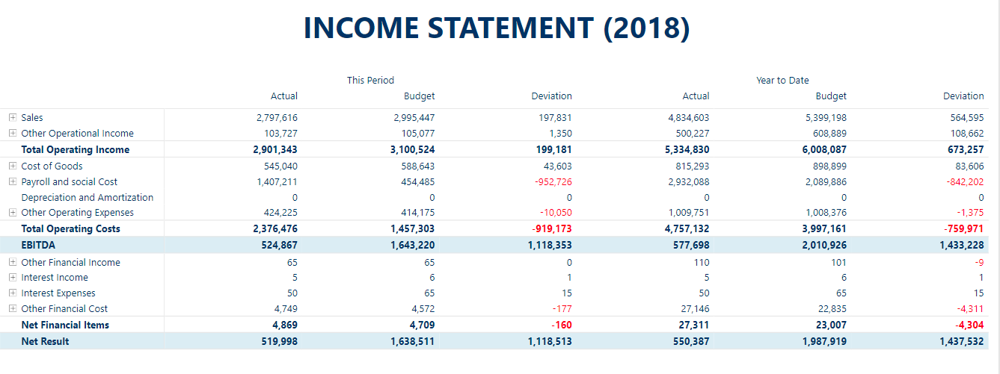

# Financial Reporting Matrix by Profitbase

[](https://github.com/Profitbase/PowerBI-visuals-FinancialReportingMatrix/releases)

Financial Reporting Matrix is a Power BI custom visual for building financial statements and other matrix-style reports that require more control over calculations, formatting and layout than the standard Power BI Matrix.

It is designed for income statements, balance sheets, cash flow statements, variance reports and other structured financial reports.

[Get it from Microsoft AppSource](https://appsource.microsoft.com/en-us/product/power-bi-visuals/WA200000642?tab=Overview) · [Documentation](https://github.com/Profitbase/PowerBI-visuals-FinancialReportingMatrix/wiki) · [Latest releases](https://github.com/Profitbase/PowerBI-visuals-FinancialReportingMatrix/releases)



## Features

### Report structure and navigation

* [Rows, columns and values](https://docs.profitbase.com/articles/PowerBI/financial-reporting-matrix/adding-data-to-the-visual.html) configured through the standard Power BI field wells
* Multiple column headers and pivoted report layouts
* [Flexible measure placement](https://docs.profitbase.com/articles/PowerBI/financial-reporting-matrix/measure-placement.html), including measures above columns or displayed as rows
* [Row expansion and collapse](https://docs.profitbase.com/articles/PowerBI/financial-reporting-matrix/row-expansion/row-expansion.html)
* [Column expansion and collapse](https://docs.profitbase.com/articles/PowerBI/financial-reporting-matrix/column-expansion/column-expansion.html)
* [Native drill-down](https://docs.profitbase.com/articles/PowerBI/financial-reporting-matrix/drill-down.html)
* [Sorting of rows and columns](https://docs.profitbase.com/articles/PowerBI/financial-reporting-matrix/sorting-rows-columns.html)
* Sticky row and column headers, with support for [pinned columns](https://docs.profitbase.com/articles/PowerBI/financial-reporting-matrix/column-styling/pin-columns.html)

### Calculations and totals

* [Custom subtotal rows](https://docs.profitbase.com/articles/PowerBI/financial-reporting-matrix/custom-subtotals-rows.html)
* Column subtotals and grand totals
* [Custom row and column calculations](https://docs.profitbase.com/articles/PowerBI/financial-reporting-matrix/calculations.html)
* Financial, mathematical, logical, statistical, date and text functions
* Calculation and formatting instructions supplied through the data model

### Formatting

* [Custom row and line formatting](https://docs.profitbase.com/articles/PowerBI/financial-reporting-matrix/row-styles-appearance/customize-row-styles.html)
* [Individual column styles](https://docs.profitbase.com/articles/PowerBI/financial-reporting-matrix/column-styling/individual-column-styles.html)
* [Conditional formatting](https://docs.profitbase.com/articles/PowerBI/financial-reporting-matrix/formatting/conditional-formatting.html)
* [Cell formatting using the `FORMAT` function](https://docs.profitbase.com/articles/PowerBI/financial-reporting-matrix/formatting/cell-formatting-using-format-function.html)
* [Data bars](https://docs.profitbase.com/articles/PowerBI/financial-reporting-matrix/data-bars.html)
* [Report theming](https://docs.profitbase.com/articles/PowerBI/financial-reporting-matrix/theming/theming.html)
* Configuration through the standard Power BI Format pane and the visual's contextual editors

### Interaction and output

* [Cross-filtering and cross-highlighting](https://learn.microsoft.com/en-us/power-bi/create-reports/service-reports-visual-interactions) with other Power BI visuals
* [Export to Excel](https://docs.profitbase.com/articles/PowerBI/financial-reporting-matrix/export-to-excel.html), including values, formatting, backgrounds, outlines and grouped row hierarchies

See the [complete Financial Reporting Matrix documentation](https://github.com/Profitbase/PowerBI-visuals-FinancialReportingMatrix/wiki) for all available features and configuration options.

## Getting started

### Install the visual

The recommended way to install Financial Reporting Matrix is through Microsoft AppSource:

* [Download from Microsoft AppSource](https://appsource.microsoft.com/en-us/product/power-bi-visuals/WA200000642?tab=Overview)
* [Download from Profitbase](https://www.profitbase.com/powerbi/) — latest official version
* [Download the latest GitHub release](https://github.com/Profitbase/PowerBI-visuals-FinancialReportingMatrix/releases)

### Configure the visual

1. Install Financial Reporting Matrix by Profitbase.
2. Add the visual to a Power BI report page.
3. Connect your data source.
4. Add fields to the visual:

   * **Rows:** Add the columns that define the report lines.
   * **Columns:** Add the columns used to group or pivot the report.
   * **Values:** Add at least one measure.
5. Use the Format pane and the visual's contextual editors to configure the report.

See [Adding data to the visual](https://docs.profitbase.com/articles/PowerBI/financial-reporting-matrix/adding-data-to-the-visual.html) for more information.

## Common tasks

### Add a custom subtotal

1. Open edit mode from the menu in the upper-right corner of the visual.
2. Right-click the row where the subtotal should be inserted.
3. Select **Add row** and enter a name.
4. Select the rows that should be included in the calculation.
5. Adjust the formula operators when required. Addition is used by default.
6. Optionally apply a custom row style and number format.

See [Custom subtotals](https://docs.profitbase.com/articles/PowerBI/financial-reporting-matrix/custom-subtotals-rows.html) for the complete instructions.

### Add conditional formatting

1. Open edit mode.
2. Right-click the relevant column header.
3. Select **Add conditional formatting**.
4. Define the conditions and choose the formatting to apply.
5. Use the Format pane to configure reusable custom styles when required.

See [Conditional formatting](https://docs.profitbase.com/articles/PowerBI/financial-reporting-matrix/formatting/conditional-formatting.html) for supported conditions, colour scales, column-index formatting and other options.

## Calculations and formatting from the data model

Financial Reporting Matrix can read formulas, formatting rules and styles from the data model. This optional advanced feature allows report configuration to be managed as data instead of being set up manually in each visual.

Example:

```json
{
  "id": "L1Sum",
  "displayName": "1Sum - Reportline",
  "formula": "L10+L12+L13+L14+L15+L17+L19",
  "style": "bold overline",
  "formatString": "#,0",
  "signFactor": 1
}
```

The properties in this example are:

* **id:** A short identifier for the report line.
* **displayName:** The description displayed in the matrix.
* **formula:** The calculation applied to the report line. Other report lines can be referenced by their IDs.
* **style:** One or more styles to apply, separated by spaces.
* **formatString:** The numeric format string. Financial Reporting Matrix uses [numbro.js](https://numbrojs.com/) for numeric formatting.
* **signFactor:** A factor used to adjust the sign of values on the report line.

See the [calculation documentation](https://docs.profitbase.com/articles/PowerBI/financial-reporting-matrix/calculations.html) and [cell-formatting documentation](https://docs.profitbase.com/articles/PowerBI/financial-reporting-matrix/formatting/cell-formatting-using-format-function.html) for more information.

## Tutorials

* [Create a basic income statement](https://www.youtube.com/watch?v=O0ibpu_np80)
* [Export to Excel](https://youtu.be/45PP28bb3h4)
* [Features introduced in version 3](https://www.youtube.com/watch?v=jHt3l1K6At8&t)

Some tutorials demonstrate earlier versions of the visual. Refer to the [current documentation](https://github.com/Profitbase/PowerBI-visuals-FinancialReportingMatrix/wiki) for the latest functionality and configuration options.

## Releases and early access

Publishing an updated Power BI custom visual to AppSource requires a submission and validation process. Fixes and new functionality may therefore be available on GitHub before the corresponding AppSource update is published.

Users who want to test the latest available package can download it from the [GitHub Releases page](https://github.com/Profitbase/PowerBI-visuals-FinancialReportingMatrix/releases).

For production use, confirm that your organisation permits custom visual packages installed outside AppSource.

## Documentation and support

* Visit the [documentation](https://github.com/Profitbase/PowerBI-visuals-FinancialReportingMatrix/wiki) for setup instructions and detailed feature information.
* [Open an issue](https://github.com/Profitbase/PowerBI-visuals-FinancialReportingMatrix/issues) to report a reproducible bug or technical problem.
* [Start a discussion](https://github.com/Profitbase/PowerBI-visuals-FinancialReportingMatrix/discussions) for questions, feedback and feature requests.

When reporting a problem, include the Financial Reporting Matrix version, Power BI version, steps to reproduce the issue and any relevant screenshots or sample data.
